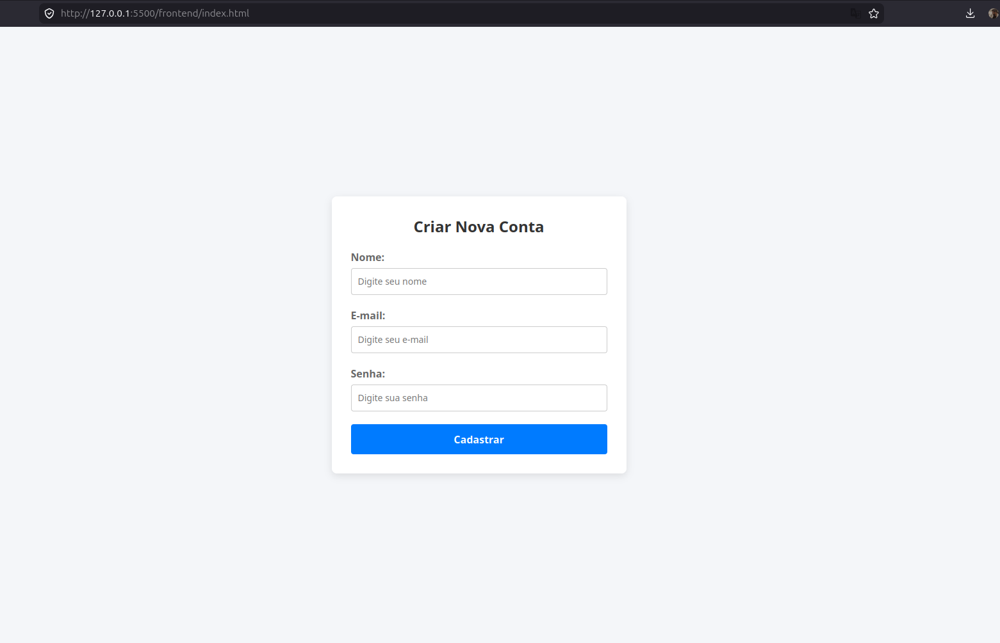
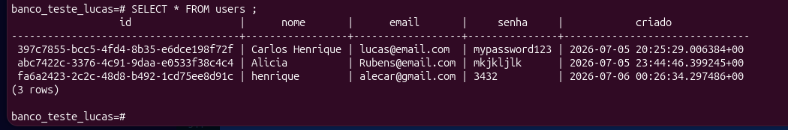

# Guia Completo de Desenvolvimento Web: Do Backend (Go + GORM) ao Frontend (TypeScript + HTML/CSS)

Este guia prático foi estruturado para consolidar o aprendizado do sistema web desenvolvido, cobrindo desde a configuração do banco de dados e a arquitetura em camadas no backend até a integração com uma interface visual moderna em TypeScript.

---

## 🛠️ Capítulo 1: Pré-requisitos e Instalação do Ambiente

Antes de iniciar o desenvolvimento, é necessário garantir que todas as ferramentas básicas estejam instaladas no sistema operacional (foco em distribuições baseadas em Linux/Ubuntu).

### 1. Backend: Instalação do Go

Certifique-se de ter a versão estável do Go instalada (recomendado Go 1.23 ou superior).

```bash
# Atualize os repositórios locais
sudo apt update

# Instale o Go
sudo apt install golang-go

# Verifique se a instalação foi bem-sucedida
go version
```

### 2. Banco de Dados: PostgreSQL

O banco de dados è instalado dentro do docker.
È preciso instalar o docker engine(não o docker desktop). Após isso, veja que tem um arquivo 
chamado docker-compose.yml que orquestra a instalaçção do container e a construção do banco de dados.
Para entrar dentro do banco de dados, deve-se entrar no docker e entrar no post em seguida. Siga os comandos abaixo.

```bash
# Rodar o docker-compose.yml
docker compose up -d

# Em seguida verificar se o container "postgres_teste" está rodando
docker ps OU docker ps -a para ver todos os containers

# Entrar no banco de dados, verificar o nome do bando e do usuario no arquivo docker-compose.yml
psql -U usuaria-lucas -d banco_teste_lucas

# Verificar todoas as tabelas que estão no banco
\dt # nenhum foi criada

# Criar a tabela users
 CREATE TABLE users (
    id VARCHAR(36) PRIMARY KEY,
    nome VARCHAR(50) NOT NULL,
    email VARCHAR(100) NOT NULL,
    senha VARCHAR(100) NOT NULL,
    medicamento VARCHAR(30) NOT NULL,
    data_nascimento DATE,
    criado TIMESTAMPTZ DEFAULT NOW()
);

# verificar os dados da tabela, se tiver vai aparecer senão não irá apraecer nada
SELECT * FROM users;

# Você pode testar o banco com 
curl -X POST http://localhost:8080/usuary   -H "Content-Type: application/json"   -d '{"name": "Alicia", "email": "Rubens@email.com", "senha": "mkjkljlk"}'


```

### 3. Frontend: NodeJS e NPM

O NodeJS é necessário para gerenciar os pacotes do frontend e executar o compilador do TypeScript.

```bash
# Instalação do NodeJS e do gerenciador de pacotes NPM
sudo apt install nodejs npm

# Verifique as versões instaladas
node -v
npm -v
```

---

## 📂 Capítulo 2: Estrutura de Pastas do Projeto

O projeto adota o padrão de mercado baseado em Clean Architecture e separação estrita de responsabilidades em um repositório unificado (Monorepo).
```bash

My_project/
├── go.mod # Gerenciador de dependências do Go
├── go.sum # Checagem de integridade dos pacotes Go
├── main.go # Ponto de entrada da aplicação backend
├── internal/ # Código privado do Go (não importável externamente)
│ ├── interface_test/
│ │ └── estrutura.go # Entidades do banco e DTOs da API
│ ├── handdler/
│ │ └── handler.go # Camada HTTP / Controladores
│ ├── service/
│ │ └── service.go # Regras de negócio e validações
│ └── repository/
│ ├── database.go # Configuração do Pool de Conexões GORM
│ └── repository.go # Operações de persistência (INSERT)
└── frontend/ # Pasta exclusiva do Frontend
├── index.html # Estrutura visual da página
├── style.css # Estilização da interface
├── app.ts # Lógica do cliente em TypeScript
├── app.js # Arquivo compilado final (gerado automaticamente)
└── package.json # Dependências de desenvolvimento do frontend


```


---

## 🖥️ Capítulo 3: O Desenvolvimento do Backend (Golang)

### 1. Inicializando o Módulo Go e Baixando Dependências

Na raiz do projeto (`lambda_project/`), execute os comandos para criar o escopo do projeto e obter os pacotes necessários:

```bash
go mod init app
go get github.com/go-chi/chi/v5
go get github.com/go-chi/cors
go get github.com/google/uuid
go get gorm.io/driver/postgres
go get gorm.io/gorm
```

### 2. Camada de Modelos e DTOs (`internal/interface_test/estrutura.go`)

Diferenciação clara entre o modelo relacional do banco de dados e os objetos de transferência de dados (DTOs) públicos.

```go
package interface_test

import "time"

// User representa o modelo físico no banco de dados gerenciado pelo GORM
type User struct {
    ID       string    `gorm:"primaryKey;type:uuid"`
    Name     string    `gorm:"column:nome;type:varchar(100);not null"`
    Email    string    `gorm:"uniqueIndex;type:varchar(100);not null"`
    Senha    string    `gorm:"type:varchar(255);not null"`
    CriadoEm time.Time `gorm:"column:criado;default:CURRENT_TIMESTAMP"`
}

// UserRequest mapeia o JSON de entrada enviado pelo formulário
type UserRequest struct {
    Name  string `json:"name"`
    Email string `json:"email"`
    Senha string `json:"senha"`
}

// UserResponse mascara dados sensíveis (exclui a senha) na resposta HTTP
type UserResponse struct {
    ID        string    `json:"id"`
    Name      string    `json:"name"`
    Email     string    `json:"email"`
    Senha     string    `json:"senha"`
    Criado_em time.Time `json:"criado_em"`
}
```

### 3. Gerenciamento do Banco e Pool de Conexões (`internal/repository/database.go`)

Configuração que mitiga gargalos de desempenho limitando conexões simultâneas e reciclando recursos inativos no PostgreSQL.

```go
package repository

import (
    "fmt"
    "time"

    "gorm.io/driver/postgres"
    "gorm.io/gorm"
)

func OpenDBWithGORM() (*gorm.DB, error) {
    dsn := "host=localhost port=5432 user=usuario_lucas password=123456 dbname=banco_teste_lucas sslmode=disable"

    db, err := gorm.Open(postgres.Open(dsn), &gorm.Config{})
    if err != nil {
        return nil, fmt.Errorf("erro ao abrir conexão com GORM: %v", err)
    }

    sqlDB, err := db.DB()
    if err != nil {
        return nil, err
    }

    // Configuração obrigatória do Pool de Conexões para Produção
    sqlDB.SetMaxOpenConns(25)                  // Limite de conexões ativas simultâneas
    sqlDB.SetMaxIdleConns(25)                  // Mantém conexões prontas em standby
    sqlDB.SetConnMaxLifetime(5 * time.Minute)  // Tempo limite de vida de cada conexão

    return db, nil
}
```

### 4. Camada de Persistência (`internal/repository/repository.go`)

Abstração responsável unicamente por interagir com o mecanismo do GORM.

```go
package repository

import (
    "app/internal/interface_test"
    "gorm.io/gorm"
)

type UsuarioRepository interface {
    SalvarNoBanco(user *interface_test.User) error
}

type GormRepository struct {
    db *gorm.DB
}

func NewGormRepository(db *gorm.DB) *GormRepository {
    return &GormRepository{db: db}
}

func (r *GormRepository) SalvarNoBanco(user *interface_test.User) error {
    result := r.db.Create(user) // GORM gera o INSERT INTO de forma nativa e segura
    return result.Error
}
```

### 5. Camada de Regras de Negócio (`internal/service/service.go`)

Coração do sistema onde os dados são processados, validados e enriquecidos antes de persistirem.

```go
package service

import (
    "app/internal/interface_test"
    "app/internal/repository"
    "errors"
    "time"

    "github.com/google/uuid"
)

type UsuarioService interface {
    CriarUsuario(nome, email, senha string) (*interface_test.UserResponse, error)
}

type Servico struct {
    repo repository.UsuarioRepository // Acoplado apenas ao contrato da Interface
}

func NewUsuarioService(repo repository.UsuarioRepository) *Servico {
    return &Servico{repo: repo}
}

func (s *Servico) CriarUsuario(nome, email, senha string) (*interface_test.UserResponse, error) {
    // Regra de Negócio: Bloqueia inserções inválidas
    if nome == "" {
        return nil, errors.New("nome não pode ser vazio")
    }

    // Enriquecimento dos dados brutos vindos do cliente
    novoUsuario := &interface_test.User{
        ID:       uuid.New().String(),
        Name:     nome,
        Email:    email,
        Senha:    senha,
        CriadoEm: time.Now(),
    }

    err := s.repo.SalvarNoBanco(novoUsuario)
    if err != nil {
        return nil, err
    }

    // Retorna o DTO de resposta preenchido com dados públicos seguros
    return &interface_test.UserResponse{
        ID:        novoUsuario.ID,
        Name:      novoUsuario.Name,
        Email:     novoUsuario.Email,
        Senha:     novoUsuario.Senha,
        Criado_em: novoUsuario.CriadoEm,
    }, nil
}
```

### 6. Controlador HTTP (`internal/handdler/handler.go`)

Responsável por deserializar o payload recebido e enviar as respostas com os códigos de status HTTP apropriados.

```go
package handdler

import (
    "app/internal/interface_test"
    "app/internal/service"
    "encoding/json"
    "net/http"
)

type UsuarioHandler struct {
    srv service.UsuarioService
}

func NewUsuarioHandler(srv service.UsuarioService) *UsuarioHandler {
    return &UsuarioHandler{srv: srv}
}

func (h *UsuarioHandler) CriaUsuarioHanddler(w http.ResponseWriter, r *http.Request) {
    var Req interface_test.UserRequest

    // Decodifica o corpo da requisição JSON para a struct Request DTO
    err := json.NewDecoder(r.Body).Decode(&Req)
    if err != nil {
        http.Error(w, "Erro no payload: "+err.Error(), http.StatusBadRequest)
        return
    }

    user, err := h.srv.CriarUsuario(Req.Name, Req.Email, Req.Senha)
    if err != nil {
        http.Error(w, "Erro no service: "+err.Error(), http.StatusBadRequest)
        return
    }

    w.Header().Set("Content-Type", "application/json")
    w.WriteHeader(http.StatusCreated) // HTTP 201
    json.NewEncoder(w).Encode(user)
}
```

### 7. Inicialização Globals (`main.go`)

Montagem e orquestração do grafo de dependências, injeção dos componentes de infraestrutura e gerenciamento de middlewares do Chi (incluindo tratamento estrito do CORS).

```go
package main

import (
    "app/internal/handdler"
    "app/internal/interface_test"
    "app/internal/repository"
    "app/internal/service"
    "fmt"
    "log"
    "net/http"
    "time"

    "github.com/go-chi/chi/v5"
    "github.com/go-chi/chi/v5/middleware"
    "github.com/go-chi/cors"
)

func main() {
    // 1. Inicializa o pool do banco de dados
    db, err := repository.OpenDBWithGORM()
    if err != nil {
        log.Fatalf("Falha crítica no banco: %v", err)
    }

    // 2. Garante a criação automática da tabela com base no modelo
    err = db.AutoMigrate(&interface_test.User{})
    if err != nil {
        log.Fatalf("Erro ao rodar migrações: %v", err)
    }

    // 3. Resolução e injeção de dependências
    repo := repository.NewGormRepository(db)
    srv := service.NewUsuarioService(repo)
    handler := handdler.NewUsuarioHandler(srv)

    router := chi.NewRouter()

    // 4. Configuração de CORS: ESSENCIAL para permitir chamadas do Frontend assíncrono
    router.Use(cors.Handler(cors.Options{
        AllowedOrigins:   []string{"*"}, // Em produção, restrinja para o domínio real do front
        AllowedMethods:   []string{"GET", "POST", "PUT", "DELETE", "OPTIONS"},
        AllowedHeaders:   []string{"Accept", "Authorization", "Content-Type", "X-CSRF-Token"},
        ExposedHeaders:   []string{"Link"},
        AllowCredentials: true,
        MaxAge:           300,
    }))

    // Middlewares nativos do Chi para diagnóstico e resiliência
    router.Use(middleware.Logger)
    router.Use(middleware.Recoverer) // Previne quedas do servidor caso ocorra um panic
    router.Use(middleware.Timeout(60 * time.Second))

    // Definição do Endpoint RESTful
    router.Post("/usuary", handler.CriaUsuarioHanddler)

    fmt.Println("Servidor iniciado em http://localhost:8080...")
    log.Fatal(http.ListenAndServe(":8080", router))
}
```

---

## 🎨 Capítulo 4: O Desenvolvimento do Frontend (TypeScript + HTML/CSS)

Navegue até a pasta dedicada ao frontend: `cd frontend/`.

### 1. Inicializando e Configurando o TypeScript localmente

Para mitigar problemas de permissões administrativas (EACCES), as ferramentas devem ser instaladas localmente no escopo de desenvolvimento do pacote:

```bash
npm init -y
npm install --save-dev typescript
npx tsc --init
```

### 2. Interface de Usuário (`frontend/index.html`)

Mapeamento dos componentes visuais e ancoragem estrutural com o script JavaScript transpilado final.

```html
<!DOCTYPE html>
<html lang="pt-BR">
<head>
    <meta charset="UTF-8">
    <meta name="viewport" content="width=device-width, initial-scale=1.0">
    <title>Cadastro de Usuário</title>
    <link rel="stylesheet" href="style.css">
</head>
<body>
    <div class="container">
        <h2>Criar Nova Conta</h2>
        <form id="cadastroForm">
            <div class="form-group">
                <label for="nome">Nome:</label>
                <input type="text" id="nome" required placeholder="Digite seu nome">
            </div>
            <div class="form-group">
                <label for="email">E-mail:</label>
                <input type="email" id="email" required placeholder="Digite seu e-mail">
            </div>
            <div class="form-group">
                <label for="senha">Senha:</label>
                <input type="password" id="senha" required placeholder="Digite sua senha">
            </div>
            <button type="submit">Cadastrar</button>
        </form>
        <div id="mensagem" class="hidden"></div>
    </div>
    <!-- Importação imperativa do script compilado em JS -->
    <script src="app.js"></script>
</body>
</html>
```

### 3. Folha de Estilos (`frontend/style.css`)

```css
body {
    font-family: 'Segoe UI', system-ui, sans-serif;
    background-color: #f4f6f9;
    display: flex;
    justify-content: center;
    align-items: center;
    height: 100vh;
    margin: 0;
}
.container {
    background-color: #ffffff;
    padding: 30px;
    border-radius: 8px;
    box-shadow: 0 4px 12px rgba(0, 0, 0, 0.1);
    width: 100%;
    max-width: 400px;
}
h2 { text-align: center; color: #333; margin-top: 0; }
.form-group { margin-bottom: 20px; }
label { display: block; margin-bottom: 6px; color: #666; font-weight: 600; }
input { width: 100%; padding: 10px; border: 1px solid #ccc; border-radius: 4px; box-sizing: border-box; }
input:focus { border-color: #007bff; outline: none; }
button { width: 100%; padding: 12px; background-color: #007bff; color: white; border: none; border-radius: 4px; font-weight: bold; cursor: pointer; }
button:hover { background-color: #0056b3; }
#mensagem { margin-top: 15px; padding: 10px; border-radius: 4px; text-align: center; }
.success { background-color: #d4edda; color: #155724; }
.error { background-color: #f8d7da; color: #721c24; }
.hidden { display: none; }
```

### 4. Captura e Disparo Assíncrono (`frontend/app.ts`)

Implementação estrita de tipos para encapsulamento e envio do payload JSON à API RESTful.

```typescript
interface UserRequest {
    name: string;
    email: string;
    senha: string;
}

const form = document.getElementById('cadastroForm') as HTMLFormElement;
const msgDiv = document.getElementById('mensagem') as HTMLDivElement;

form.addEventListener('submit', async (event: Event) => {
    event.preventDefault(); // Bloqueia a recarga padrão da página

    const nomeInput = document.getElementById('nome') as HTMLInputElement;
    const emailInput = document.getElementById('email') as HTMLInputElement;
    const senhaInput = document.getElementById('senha') as HTMLInputElement;

    const dadosUsuario: UserRequest = {
        name: nomeInput.value,
        email: emailInput.value,
        senha: senhaInput.value
    };

    try {
        // Envio do payload assíncrono para o Backend em Go
        const response = await fetch('http://localhost:8080/usuary', {
            method: 'POST',
            headers: { 'Content-Type': 'application/json' },
            body: JSON.stringify(dadosUsuario)
        });

        if (response.ok) {
            const usuarioCriado = await response.json();
            exibirMensagem(`✅ Usuário criado com sucesso! ID: ${usuarioCriado.id}`, 'success');
            form.reset();
        } else {
            const erroTexto = await response.text();
            exibirMensagem(`❌ Erro: ${erroTexto}`, 'error');
        }
    } catch (error) {
        exibirMensagem('❌ Erro crítico: Falha ao estabelecer conexão com o backend.', 'error');
    }
});

function exibirMensagem(texto: string, tipo: 'success' | 'error') {
    msgDiv.innerText = texto;
    msgDiv.className = tipo;
}
```

---

## 🚀 Capítulo 5: Ciclo de Execução e Homologação do Fluxo

Para validar todo o ecossistema integrado:

### Compilação do Frontend (TypeScript para JavaScript)

Dentro do diretório `frontend/`, execute o compilador configurado na pasta:

```bash
npx tsc
```

(Este comando lerá o arquivo `tsconfig.json`, detectará o arquivo `app.ts` e gerará o arquivo de produção funcional `app.js` sem interferências).

### Inicialização do Servidor Backend

Retorne à raiz do projeto (`cd ..`) e execute a aplicação Go:

```bash
go run main.go
```

### Execução do Teste de Integração

Abra o arquivo `index.html` no navegador de sua preferência. Preencha os campos do formulário e acione o botão "Cadastrar". A interface responderá dinamicamente exibindo o ID único gerado pelo backend através do banco de dados relacional.

___



___

